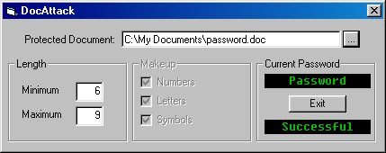



## DocAttack 1\.0

### Description

I recently had a co-worker approach me asking that I assist them with a password-protected Word 97 document for which they had forgotton the password. This program performs a brute-force attack against a password protected Microsoft Word document. The code utilizes dynamic arrays, vba office automation, common dialogs, numeric-only textboxes, and the timer control examples. In future iterations I would like to include the ability to limit the possible characters searched, multi-processor support, as well as additional types of office documents (i.e. workbooks, databases...)
 
### More Info
 
A word document, and a minimum and maximum password length restraint.

Setec Astronomy

the password for openning the protected document.

             |
---                |---
**Submitted On**   |2001-08-28 22:57:26
**By**             |[Tedder Reed](https://github.com/Planet-Source-Code/PSCIndex/blob/master/ByAuthor/tedder-reed.md)
**Level**          |Beginner
**User Rating**    |4.0 (16 globes from 4 users)
**Compatibility**  |VB 5\.0, VB 6\.0
**Category**       |[Complete Applications](https://github.com/Planet-Source-Code/PSCIndex/blob/master/ByCategory/complete-applications__1-27.md)
**World**          |[Visual Basic](https://github.com/Planet-Source-Code/PSCIndex/blob/master/ByWorld/visual-basic.md)
**Archive File**   |[DocAttack 255218282001\.zip](https://github.com/Planet-Source-Code/tedder-reed-docattack-1-0__1-26757/archive/master.zip)

